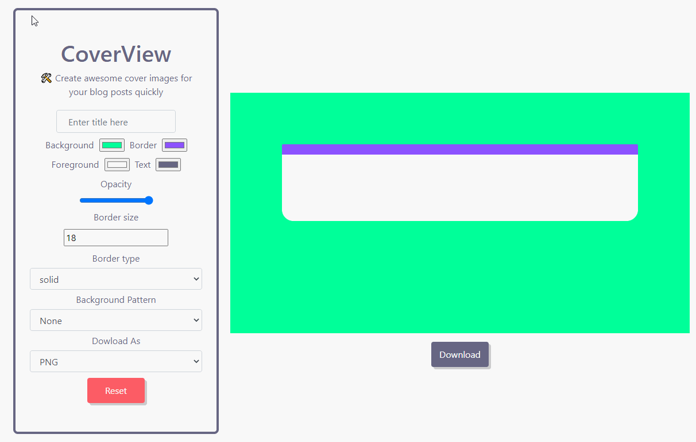
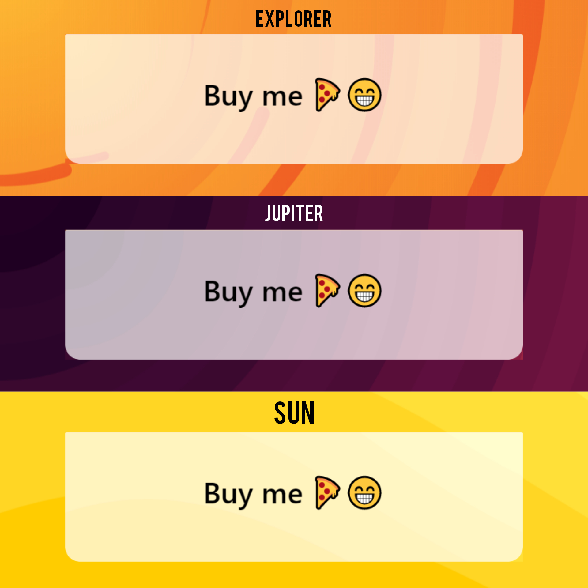
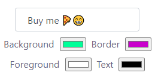

### [Original Repo] | [Check it out here]

### What is CoverView 🤔

Awesome tool that helps you create cover images for your blog posts 🎨

### My PR 👇🏻

## More Customisation Options ✨

- Change foreground and text color 🎨
- Change opacity/transparency of the foreground 🕹
- Added input for border size #️⃣
- Added 3 more backgroud patterns 🪐
- Added Reset button 🔁
- Choose diffrent border types 🧐
- Now Supports download as JPEG ⏬
- Refactored Codebase 👌🏻

## Added Background Patterns 👇🏻

### Side Note 😬

Couldnt fix the allignment for foreground color picker and text color picker , i am bad with css 🙁 and my solution was to use float but author was using flex system so didnt do it.

# ✌🏻

[original repo]: https://github.com/rutikwankhade/CoverView
[check it out here]: https://coverview.now.sh/
